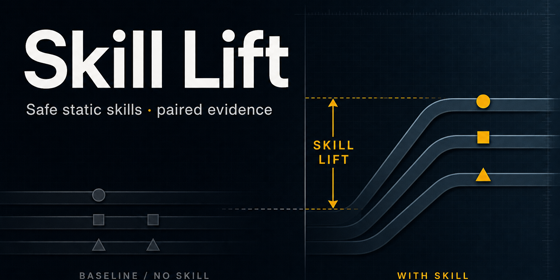

# BenchFlow Agent Skill Lift

A research repository for designing, ablating, and submitting **safe, generalizable agent skills** for the [BenchFlow Agent Skill Lift](https://www.kaggle.com/competitions/skill-lift) competition.

We treat the contest as a measurement instrument: the same models, harness, and private tasks for everyone — **skills are the only variable**. Our goal is a small library that produces real paired lift on held-out work, without safety regressions.

Governance and contributor norms live in [`AGENTS.md`](./AGENTS.md).

---

## Motivation

Agent skills — modular folders of instructions, scripts, and references — are widely shipped and weakly measured. When an agent succeeds, it is often unclear whether the model or the skill deserved credit. SkillsBench shows that curated skills can raise pass rates substantially on average, yet individual skills can also regress tasks or add nothing. Self-authored skills are frequently flat or negative. ClawsBench further shows that domain skills can improve capability while increasing unsafe actions unless explicitly constrained.

Most teams are still guessing. This repository exists to replace guesswork with **paired, safety-aware evidence**.

---

## What is BenchFlow Agent Skill Lift?

[Skill Lift](https://www.kaggle.com/competitions/skill-lift) is a Kaggle competition hosted by BenchFlow. Participants submit a skill set; organizers hold fixed a panel of frontier models, the BenchFlow harness, and a private task mix. Each task is run with and without the submission. **Lift** is the paired difference.

The private mix includes capability tasks in the SkillsBench style and safety tasks drawn from ClawsBench-style productivity environments. Critical unsafe behavior can drive a task score as low as −1.0. Public SkillsBench tasks support practice and ablation; final ranking uses the private set only.

Two tracks exist with separate leaderboards: **Static Skills** (a frozen library) and **Meta-Skills** (skills that author and refine other skills under an organizer-run evolution loop).

---

## Our Research Objective

Build the highest-performing **and safest** static skill library we can defend scientifically:

- Maximize mean paired lift on held-out tasks.
- Preserve compliance and safety under productivity hazard classes.
- Generalize beyond the public corpus (breadth across domains, not spikes on memorized tasks).
- Document which design choices caused lift — suitable for a rigorous competition writeup and for reuse after the contest ends.

Primary focus: **Track 1 — Static Skills**. Meta-Skills remain optional and secondary.

---

## Research Philosophy

Aligned with [`AGENTS.md`](./AGENTS.md):

1. **Paired evaluation is sacred** — claims require with-skills vs without-skills comparisons.
2. **Less is more** — a small set of sharp skills beats a large, noisy library.
3. **Procedures, not lookup tables** — class-level guidance that transfers to unseen domains.
4. **Safety constrains capability** — unsafe success is worse than careful completion.
5. **Evidence over intuition** — SkillsBench and ClawsBench as priors; our ablations as the update.
6. **Negative results are first-class** — regressions are recorded and used to kill bad skills.

---

## Repository Structure

| Path | Role |
|------|------|
| [`AGENTS.md`](./AGENTS.md) | Constitution — principles and operating rules |
| `README.md` | Project overview (this file) |
| [`docs/`](./docs/) | Research plan, protocol, architecture, submission materials |
| [`docs/ARCHITECTURE.md`](./docs/ARCHITECTURE.md) | Measurement architecture (diagrams) |
| [`scripts/`](./scripts/) | Validate, hash, package, pre-register, paired-lift metrics |
| [`skills/`](./skills/) | Shipped skill library (submission root) |
| [`eval/configs/`](./eval/configs/) | Frozen execution pins for EXP-001/002 |
| [`eval/experiments/`](./eval/experiments/) | Pre-registration records |
| [`eval/runs/smoke/`](./eval/runs/smoke/) | Unscored pipeline smoke (isolated from scored EXP) |
| `tests/` | Tooling unit tests and fixtures |

Architecture overview:


Kaggle card (560×280):



The competition artifact is the contents of `skills/`, packaged via `scripts/package_submission.py`.

---

## Design Principles

- **Tiered library:** safety/scope → execution discipline → brittle formats → thin domain packs.
- **Progressive disclosure:** rich `description` for routing; lean `SKILL.md` body; details in `references/` on demand.
- **Harness portability:** skills must work under BenchFlow’s neutral mount and multi-agent discovery paths.
- **Promotion gates:** structure, non-leakage, ablation support, and safety review before a skill enters `skills/`.
- **Ablation ladder:** null → safety-only → workflow → formats → domains → full; ship the Pareto point on lift × safety × size.

---

## Development Roadmap

| Phase | Focus |
|-------|--------|
| **0 — Foundations** | Constitution (`AGENTS.md`), overview (`README.md`), research norms |
| **1 — Scaffolding** | Repository layout, packaging, skill hygiene tests |
| **2 — Core library** | First candidate: `safe-task-execution` (in progress on feature branch) |
| **3 — Transfer packs** | Deferred until EXP-001/002 decide keep/revise |
| **4 — Measured domain thins** | Domain skills only where ablations show stable lift |
| **5 — Public evaluation** | Smoke PASS; scored EXP-001/002 queued |
| **6 — Submission** | Card, architecture, storyboard, description drafted; zip after evidence |
| **7 — Post-contest** | Publish ablations and reusable methodology |

Phases may overlap; promotion always requires evidence.

---

## Competition Strategy

- Enter **Static Skills** as the primary track.
- Keep the shipped library small and ablation-justified.
- Use the public corpus for development and leave-one-domain-out checks — not as a memorization target.
- Treat safety as a first-class score component, not a post-hoc filter.
- Write the Kaggle writeup as a research note: what lifted, what regressed, and why we expect private transfer.

Detailed operating rules for agents and contributors: [`AGENTS.md`](./AGENTS.md).

---

## Repository Status

**Candidate branch:** `cursor/safe-task-execution-skill-a21e` (not merged to `main` until EXP keep/revise/reject).

| Milestone | Status |
|-----------|--------|
| Governance + eval tooling | Done |
| Candidate skill `safe-task-execution` | Authored; library hash locked |
| EXP-001 / EXP-002 pre-registration + freeze configs | Done |
| Runtime audit (BenchFlow 0.6.3 lock) | Done |
| Unscored smoke (`citation-check` control+treatment) | **PASS** |
| Scored EXP-001 / EXP-002 | **Not started** (intentional pause) |

Locked library hash:

`72685e220e282607ebad10ba1ff0c6aab591d34cd73a461e752f11aeb6696521`

Smoke proves the Docker → agent → verifier → trials path. It is **not** a scored lift claim. See [`eval/runs/smoke/SMOKE_REPORT.md`](./eval/runs/smoke/SMOKE_REPORT.md).

Submission prep (pre-score): [`docs/submission/KAGGLE_DESCRIPTION.md`](./docs/submission/KAGGLE_DESCRIPTION.md), [`docs/DEMO_STORYBOARD.md`](./docs/DEMO_STORYBOARD.md), [`docs/submission/SKILL_DOC_REVIEW.md`](./docs/submission/SKILL_DOC_REVIEW.md).

### Tooling quick start

```bash
python3 scripts/validate_skills.py --skills-dir skills
python3 scripts/hash_library.py --skills-dir skills
python3 scripts/compute_lift.py path/to/trials.json
python3 scripts/package_submission.py --skills-dir skills
python3 -m unittest discover -s tests -v
```

### Locked eval runtime (for smoke / scored runs)

```bash
# separate SkillsBench checkout at the pinned commit
git checkout 9a1f4dd5f7659f75707435da3ce854b6e48321d1
uv sync --locked
uv run bench --version   # expect 0.6.3
# then: uv run bench eval run ... (see eval/configs/common.yaml)
```

Do not `uv lock --upgrade-package benchflow`.

---

## How Contributors Can Help

We welcome contributions that improve **measured safe lift** or the research apparatus around it:

- Propose or refine portable skills with clear triggers and applicability bounds.
- Run and report paired ablations (including negative results).
- Improve leakage, budget, and safety hygiene checks.
- Strengthen writeup materials without contradicting [`AGENTS.md`](./AGENTS.md).

**While EXP-001/002 are frozen:** do not edit `skills/safe-task-execution/SKILL.md` or pre-registration JSON — that invalidates the locked hash.

Before contributing code or skills, read [`AGENTS.md`](./AGENTS.md). Prefer small PRs with a hypothesis and an evaluation story.

---

## Disclaimer

This is an independent research repository for participation in BenchFlow’s Agent Skill Lift competition. It is not affiliated with, endorsed by, or sponsored by BenchFlow, Kaggle, or the model providers used in evaluation, beyond use of their public benchmarks, documentation, and contest rules.

Evaluation outcomes depend on organizer-held private tasks, model panels, and harness versions outside our control. Public results do not guarantee private ranking. Nothing in this repository is permission to bypass sandbox, grader, or safety controls.

Competition rules, deadlines, and rubrics are defined by the organizers; participants are responsible for compliance.
