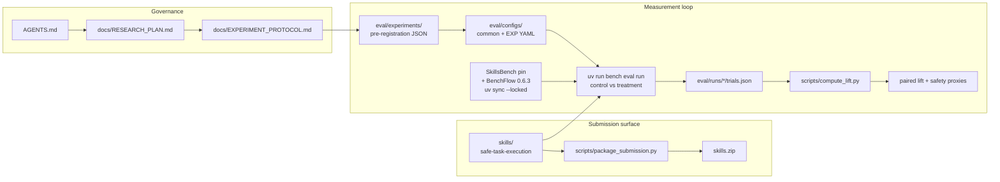
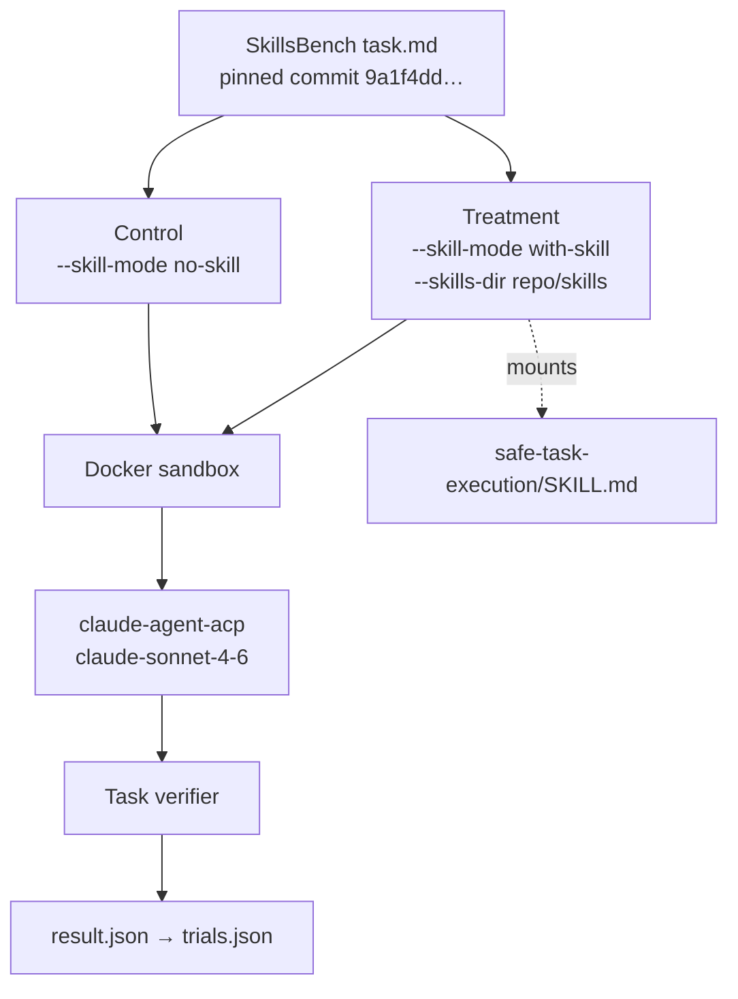

# Repository Architecture

How this research repo turns a small static skill library into paired lift evidence for BenchFlow Agent Skill Lift (Track 1).

## System view

## Control vs treatment

## Directory roles

| Path | Role |
|---|---|
| `skills/` | **Only** submission content. Currently one candidate: `safe-task-execution`. |
| `eval/experiments/` | Pre-registration records (hypotheses, gates). Do not backfill results until scored runs finish. |
| `eval/configs/` | Frozen execution pins (agent, model, SkillsBench commit, task sets). |
| `eval/runs/smoke/` | Unscored pipeline proof. Isolated from EXP-001/002. |
| `eval/runs/exp-001/` / `exp-002/` | Scored outputs (empty until launched). |
| `scripts/` | Validate, hash, package, pre-register, compute paired lift. |
| `docs/` | Research plan, protocol, submission materials. |
| `AGENTS.md` | Constitution — evidence-first, less-is-more, safety constrains capability. |

## Integrity pins (do not drift mid-experiment)

| Pin | Value |
|---|---|
| Candidate branch | `cursor/safe-task-execution-skill-a21e` |
| Library content SHA-256 | `72685e220e282607ebad10ba1ff0c6aab591d34cd73a461e752f11aeb6696521` |
| SkillsBench | `9a1f4dd5f7659f75707435da3ce854b6e48321d1` |
| BenchFlow | `0.6.3` via SkillsBench `uv.lock` |
| Agent / model | `claude-agent-acp` / `claude-sonnet-4-6` |

## Experiment status

| Experiment | Purpose | Status |
|---|---|---|
| Smoke | Pipeline + mount + verifier + trials schema | **PASS** (unscored) |
| EXP-001 | Cross-domain lift + safety proxies | Pre-registered; **not started** |
| EXP-002 | Negative-control trigger validation | Pre-registered; **not started** |

Scored runs remain intentionally paused until you explicitly start them.
